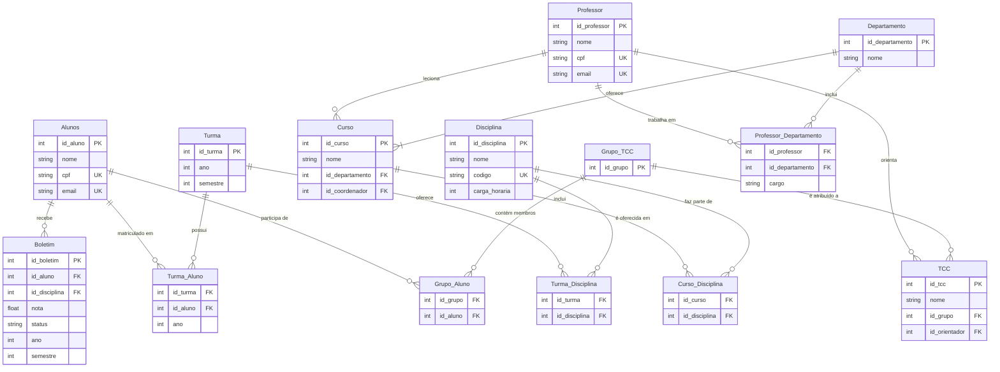

```mermaid


erDiagram
    Alunos {
        int id_aluno PK
        string nome
        string cpf UK
        string email UK
    }
    Professor {
        int id_professor PK
        string nome
        string cpf UK
        string email UK
    }
    Departamento {
        int id_departamento PK
        string nome
    }
    Curso {
        int id_curso PK
        string nome
        int id_departamento FK
        int id_coordenador FK
    }
    Disciplina {
        int id_disciplina PK
        string nome
        string codigo UK
        int carga_horaria
    }
    Curso_Disciplina {
        int id_curso FK
        int id_disciplina FK
    }
    Turma {
        int id_turma PK
        int ano
        int semestre
    }
    Turma_Disciplina {
        int id_turma FK
        int id_disciplina FK
    }
    Turma_Aluno {
        int id_turma FK
        int id_aluno FK
        int ano
    }
    Boletim {
        int id_boletim PK
        int id_aluno FK
        int id_disciplina FK
        float nota
        string status
        int ano
        int semestre
    }
    Grupo_TCC {
        int id_grupo PK
    }
    Grupo_Aluno {
        int id_grupo FK
        int id_aluno FK
    }
    TCC {
        int id_tcc PK
        string nome
        int id_grupo FK
        int id_orientador FK
    }
    Professor_Departamento {
        int id_professor FK
        int id_departamento FK
        string cargo
    }

    Alunos ||--o{ Boletim : "recebe"
    Alunos ||--o{ Turma_Aluno : "matriculado em"
    Alunos ||--o{ Grupo_Aluno : "participa de"
    Professor ||--o{ Curso : "leciona"
    Professor ||--o{ TCC : "orienta"
    Departamento ||--|{ Curso : "oferece"
    Curso ||--o{ Curso_Disciplina : "inclui"
    Disciplina ||--o{ Curso_Disciplina : "faz parte de"
    Turma ||--o{ Turma_Disciplina : "oferece"
    Disciplina ||--o{ Turma_Disciplina : "é oferecida em"
    Turma ||--o{ Turma_Aluno : "possui"
    Grupo_TCC ||--o{ TCC : "é atribuído a"
    Grupo_TCC ||--o{ Grupo_Aluno : "contém membros"
    Professor ||--o{ Professor_Departamento : "trabalha em"
    Departamento ||--o{ Professor_Departamento : "inclui"
```
